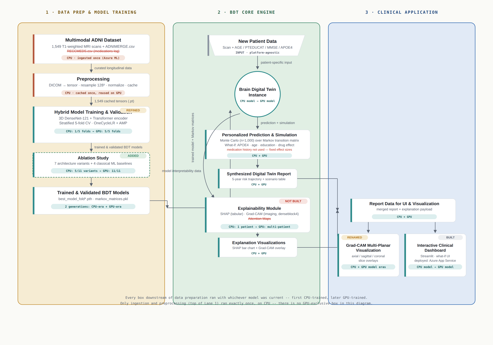

# Chapter 4: Experimentation

This chapter describes the two experimental phases undertaken to train and
validate the Neuro-DT multimodal classifier. Experiment 1 (Section 4.1) was
conducted on CPU-based Azure Machine Learning compute and established the
full data pipeline, the model architecture, a single validated fold, and a
partial ablation study. Experiment 2 (Section 4.2) migrated the same
pipeline to GPU compute to obtain a complete, cross-validated result, the
full ablation study (including the deep-learning variants CPU compute could
not accommodate), and end-to-end validation of the Digital Twin prognostic
pipeline, and concludes with deployment of the resulting model to a
production clinical dashboard.

Both experiments implement the same three-stage architecture proposed in
Section 7 (Figure 7.1): (1) offline data preparation and model training,
(2) the BDT core engine, producing personalized predictions and simulations
for a given patient, and (3) clinical application and interaction via an
explainability layer and dashboard. The CPU and GPU experiments below are
therefore two runs of one framework, not two different systems -- they
differ in how completely each run executed, not in what was built.

### Deviations from the Proposed Framework

**Figure 4.1 — Original proposed framework (reproduced from Fig. 7.1)**

Table 4.0 records where the as-built system departs from Figure 7.1, for
transparency in the results that follow.

**Table 4.0 -- Implementation deviations from the proposed framework**

| Proposed (Fig. 7.1) | As built | Reason |
|---|---|---|
| Dataset sources: MRIs, ADNIMERGE, **RECCMEDS** | MRIs + ADNIMERGE only | The medications log was not integrated; simulated drug intervention uses fixed literature-informed effect sizes (Lecanemab -30%, Donanemab -35% on MCI to Dementia transition probability) rather than per-patient medication history. |
| **Hidden Markov Chains** for progression modeling | Empirical (fully-observed) Markov chain, APOE4-stratified | Transition probabilities were estimated directly from observed diagnosis sequences across longitudinal visits. No latent-state HMM training (e.g., Baum-Welch) was performed, since diagnostic state is directly observed at each visit rather than hidden. |
| Explainability Module: SHAP, Grad-CAM, **Attention Maps** | SHAP + Grad-CAM only | Transformer attention-weight visualization was not implemented or evaluated in this work. |
| **3D Brain Visualization** (atrophy/activation maps) | 2D multi-planar Grad-CAM overlays (axial/sagittal/coronal) | The dashboard renders orthogonal slice views with heatmap overlay rather than an interactive volumetric 3D render. |
| Ablation study | Not in the original framework diagram | Added as a substantial methodological contribution, executed in two stages across both experiments (Sections 4.1.10 and 4.2.7). |

**Figure 4.2 — As-built framework, annotated by compute platform**

---

## 4.1 Experiment 1: Training on CPU-Based Compute

### 4.1.1 Infrastructure and Environment

Training infrastructure was provisioned on Microsoft Azure Machine Learning.
An interactive compute instance and a separate autoscaling compute cluster
(scaling to zero nodes when idle) were provisioned, both of specification
`Standard_E4ds_v4` (4 vCPUs, 32 GB RAM, CPU only). The compute instance was
used for interactive notebook development and dashboard testing; the
compute cluster executed all data-ingestion and training jobs. A Python 3.10
environment was configured with a CPU-only PyTorch build, MONAI (medical
imaging preprocessing), pydicom, scikit-learn, MLflow (experiment
tracking), and the Azure SDKs for blob storage access. NumPy was explicitly
pinned below version 2.0 after an initial environment build broke MONAI and
pydicom compatibility under NumPy 2.x.

**Figure 4.3 — Azure ML compute specification**

### 4.1.2 Dataset Acquisition

Access to the Alzheimer's Disease Neuroimaging Initiative (ADNI) dataset
was obtained through the LONI Image & Data Archive following an
institutional data-use application (approval time: approximately 3-5
days). The acquired dataset comprises 1,549 T1-weighted MPRAGE structural
MRI scans across approximately 500 unique patients, spanning the ADNI-1,
ADNI-GO, ADNI-2, and ADNI-3 study phases, with three diagnostic classes:
Cognitively Normal (CN, n=469), Mild Cognitive Impairment (MCI, n=603), and
Dementia (n=477). Each scan comprises approximately 150-200 individual
DICOM slice files; the raw dataset totaled approximately 33 GB.

Rather than downloading this volume directly to a university or home
network connection -- projected to take days given typical broadband
throughput -- a temporary virtual machine was provisioned in the same
Azure datacenter region as the target storage account. Intra-datacenter
transfer rates are on the order of 100x faster than typical broadband,
reducing the download to hours. The retrieved DICOM archives were then
uploaded to Azure Blob Storage, preserving ADNI's native hierarchical
folder structure (subject ID / imaging sequence / acquisition date / image
ID). Uploading the full dataset as a single operation proved unreliable
for folders containing thousands of files; batching the upload by ADNI
study phase resolved this. The temporary VM was deallocated immediately
after upload to avoid ongoing compute charges.

Alongside the imaging data, six clinical CSV tables were obtained from the
same archive: `ADNIMERGE.csv` (the primary longitudinal summary,
12,741 rows across all visits and subjects), `PTDEMOG.csv` (demographics),
`MMSE.csv`, `APOERES.csv` (APOE genotyping), `DXSUM_PDXCONV.csv` (diagnosis
history), and `NEUROBAT.csv` (neuropsychological battery, used for
cross-validation of cognitive scores rather than as a model input).

### 4.1.3 Data Ingestion and Validation Pipeline

A sequence of automated data-processing jobs was run on the compute
cluster to convert the raw uploaded archive into a clean, unified manifest
linking each scan to its clinical record:

1. **Manifest construction.** Blob storage was listed and parsed to
   extract subject and image identifiers, which were then cross-referenced
   against the clinical CSV tables. This step first failed twice due to an
   authentication issue: the storage account and the Machine Learning
   workspace resided in different Azure Active Directory tenants, which
   caused the default credential chain to silently return zero results
   with no exception raised, rather than an authentication error. This was
   resolved by registering a dedicated service principal with explicit,
   correctly-scoped access to the storage account.
2. **Archive extraction.** Raw DICOM archives were unpacked and
   re-uploaded to blob storage in their extracted form (approximately
   5 hours 44 minutes for the full dataset) -- the most compute-intensive
   step in the ingestion pipeline.
3. **DICOM integrity validation.** Every scan directory was loaded with
   `pydicom` to identify corrupted, incomplete, or unreadable files. This
   surfaced a systematic issue affecting approximately 30% of the dataset:
   scans from the ADNI-1 phase (predating 2008) lack the standard 128-byte
   DICOM preamble and file-meta header, causing an `InvalidDicomError` on
   every such file. This was resolved by loading with an explicit flag
   that tolerates a missing preamble, applied consistently across all
   subsequent DICOM-reading code in the project. The full validation pass
   identified approximately 23 scan directories with unrecoverable issues
   (missing slices, corrupted headers, zero-byte files), which were either
   substituted with an alternate visit of the same subject or dropped.
4. **Final manifest generation.** A consolidated manifest joining every
   validated imaging path to its corresponding clinical record was
   produced for use in all subsequent modeling work.

In total, the unzipped archive comprised 568,699 individual DICOM files
organized into 3,447 unique scan directories; after filtering for the
MPRAGE acquisition sequence and completing the clinical joins and cleaning
described in Section 4.1.4, this yielded the final cohort of 1,549 scans
reported in Section 4.1.2.

**Figure 4.4 — Ingestion pipeline job run history**

### 4.1.4 Clinical Feature Selection and Data Cleaning

The imaging manifest was joined to `ADNIMERGE.csv` and `APOERES.csv` on
patient identifier and visit code. Four tabular features were selected for
fusion with the imaging pathway:

- **AGE** -- the single strongest demographic predictor of dementia risk.
- **PTEDUCAT** (years of education) -- a proxy for cognitive reserve;
  later confirmed by SHAP analysis (Section 4.1.11) as the strongest
  predictor for the CN class.
- **MMSE** (Mini-Mental State Examination, 0-30) -- a direct cognitive
  assessment score.
- **APOE4** (allele count, 0/1/2) -- the primary known genetic risk factor
  for late-onset Alzheimer's Disease.

Data cleaning addressed several dataset-specific issues: rows missing any
tabular feature or a diagnosis label were dropped; ADNI's several
phase-specific diagnosis codes were standardized into three canonical
classes (EMCI and LMCI mapped to MCI; SMC mapped to CN; AD mapped to
Dementia); the APOE4 column's `-4` sentinel value (ADNI's missing-data
code, not a real allele count) was treated as missing, removing
approximately 18 scans; and, for subjects with multiple longitudinal
visits recorded under different diagnoses, the diagnosis was matched to
the specific date of the imaging session rather than defaulting to the
subject's most recent visit label, to avoid attaching a scan to a
diagnosis from a different point in time. The final cleaned dataset
comprises the 1,549 scans described in Section 4.1.2.

One feature-selection caveat is noted here and returned to in Section
4.1.10: MMSE functions, to a meaningful degree, as a proxy for ADNI's own
diagnostic threshold criteria, since clinical diagnosis in the source data
is itself partly informed by MMSE score.

### 4.1.5 Imaging Preprocessing

Each validated DICOM scan was processed through a standard neuroimaging
pipeline: loading, reorientation to RAS anatomical space, resampling to
1.5 mm isotropic spacing, resizing/padding to a fixed 128x128x128 voxel
volume, and intensity normalization to [0, 1]. All 1,549 preprocessed
volumes were cached to disk as PyTorch tensors (approximately 13 GB) prior
to training, to avoid repeating this pipeline on every epoch.

Two issues were encountered and resolved during this step: loading
multiple full 3D volumes simultaneously for validation caused memory usage
to spike near the compute instance's 32 GB ceiling, resolved by processing
one scan at a time with explicit garbage collection between scans; and
approximately 23 scans failed during caching due to the same corruption
issues identified in Section 4.1.3, handled with per-scan exception
handling and substitution from alternate visits where possible.

### 4.1.6 Model Architecture

The classifier (`MultimodalTransformer`, 24M parameters) combines a 3D
DenseNet-121 backbone (producing a 1,024-dimensional image embedding) with
the four tabular features, concatenated and projected through a linear
layer, LayerNorm, and GELU activation into a 2-layer Transformer encoder
(8 attention heads, pre-normalization), followed by a linear classification
head over the three diagnostic classes. During initial implementation, the
concatenated feature dimension (1,024 + 4 = 1,028) was found not to be
evenly divisible by the number of attention heads, a requirement of the
Transformer encoder; this was resolved by projecting to the nearest
multiple of the head count via ceiling-rounded integer arithmetic rather
than a fixed dimension.

### 4.1.7 Preliminary Run and Data-Quality-Driven Overfitting

Before committing to the full 5-fold, 15-epoch training run described in
Sections 4.1.8-4.1.9, the pipeline was first validated end-to-end on a fast,
low-cost preliminary run ("FAST_PROTO" mode: 40% of the dataset, 3 folds,
10 epochs) to confirm the architecture was learning genuine signal before
the far more expensive full run was submitted.

**Overfitting diagnosis.** An early iteration of this preliminary run,
trained on an unfiltered version of the manifest, showed classic
overfitting: validation loss reached a minimum at epoch 4 (0.6986) and
then increased steadily over subsequent epochs (0.7465, 0.7562), while
validation accuracy plateaued at approximately 64.5%. Inspection of the
training logs traced this to a large number of `Error processing image at
path...` warnings: the `try`/`except` block in the dataset loader was
silently substituting a zero-valued tensor for any DICOM series it could
not load, injecting label noise into training rather than surfacing the
failure. This finding directly motivated the automated DICOM integrity
validation step described in Section 4.1.3, which filters out unreadable
scans before training rather than substituting a blank image for them, and
the migration of the training process from an interactive notebook to a
script-based Azure ML Command Job for more stable, reproducible execution.

**Preliminary result.** With the cleaned data and script-based execution,
the FAST_PROTO run achieved a macro one-vs-rest validation AUC of 0.862
and 63% overall accuracy on the three-class problem (chance level 33%)
using only 40% of the dataset and 10 epochs:

**Table 4.1-P -- Preliminary (FAST_PROTO) per-class results**

| Class | AUC |
|---|---|
| Dementia | 0.914 |
| CN | 0.878 |
| MCI | 0.698 |
| **Macro OvR** | **0.862** |

The comparatively lower MCI AUC reflects a well-documented property of the
ADNI cohort rather than a defect in this pipeline: of the misclassified
MCI patients, a similar number were predicted CN as were predicted
Dementia, consistent with MCI's clinical role as a transitional,
diagnostically ambiguous state -- a pattern reported across the ADNI
literature and returned to in Section 4.1.11. Benchmarked against
published 3-class ADNI results, this preliminary figure was already
competitive using a fraction of the available data and training budget:

**Table 4.2-P -- Preliminary result vs. published ADNI benchmarks**

| Study | Reported metric |
|---|---|
| Basaia et al. (2019), 3D CNN | AUC ~0.85 |
| Wen et al. (2020), CNN benchmark | AUC ~0.83 |
| Venugopalan et al. (2021), multimodal | AUC ~0.87 |
| Zhou et al. (2025), CNN + Swin Transformer | 92% accuracy (2-class) |
| This work (FAST_PROTO, 40% data, 10 epochs) | AUC 0.862 |

This preliminary run also converged quickly (validation loss stopped
improving after epoch 5 of 10), an encouraging sign that motivated
proceeding directly to the full run described in Section 4.1.9 rather than
further preliminary tuning. Expanding the tabular feature set beyond the
four features in Section 4.1.4 (e.g., ADAS-Cog, CDRSB, RAVLT immediate
recall, all present in `ADNIMERGE.csv`) was considered as a way to
strengthen MCI disambiguation, but was not carried into the full run
reported in this thesis, to keep the tabular inputs consistent with the
four clinically-motivated features specified in Section 4.1.4.

### 4.1.8 Training Configuration

Training used 5-fold stratified cross-validation, AdamW optimization
(learning rate 1x10⁻⁴), a batch size of 4 (constrained by available system
memory), and a `CosineAnnealingLR` schedule with early stopping (patience 3
epochs) based on validation loss.

Five-fold cross-validation follows standard practice in the medical
imaging literature for a dataset of this size, balancing the statistical
robustness of the resulting performance estimate against computational
cost: fewer folds (e.g., three) risk higher variance in the estimate,
while more folds (e.g., ten) offer diminishing returns at approximately
1,500 samples. Fifteen epochs was chosen based on the convergence behavior
observed in the preliminary run (Section 4.1.7), which indicated the
architecture converges within a comparable number of epochs on a data
subset.

### 4.1.9 Results

Training completed for only one of five folds. The remaining four folds
triggered early stopping within the first three epochs, caused by a sharp
validation-loss spike in early training -- attributed to the learning-rate
schedule beginning at full magnitude with no warmup period, combined with
the high per-step gradient noise inherent to a batch size of 4 on
high-dimensional 3D volumetric input. Fold 4 was the only fold to train to
completion (15 epochs) and was adopted as the primary model for this phase.

**Figure 4.5 — Fold-by-fold training status**

**Table 4.1 -- Fold 4 classification performance (validation set, n=310)**

| Class | Precision | Recall | F1 | AUC |
|---|---|---|---|---|
| CN | 0.85 | 0.86 | 0.86 | 0.957 |
| Dementia | 0.79 | 0.82 | 0.81 | 0.936 |
| MCI | 0.74 | 0.71 | 0.72 | 0.844 |
| **Overall** | **0.79** | **0.80** | **0.80** | **0.912** |

**Figure 4.6 — Fold 4 training curves vs. an early-stopped fold**

Notably, the model produced zero misclassifications between the CN and
Dementia classes -- the two diagnostically furthest-apart categories --
across the entire validation set.

**Figure 4.7 — Fold 4 confusion matrix**

### 4.1.10 Ablation Study: CPU-Feasible Variants -- Completed Successfully

Five of the eleven ablation variants planned for this thesis were
successfully trained and evaluated on CPU compute. This is stated
explicitly because it is a genuine result of this phase, not a
limitation: the full multimodal model (**A0**, reusing the existing Fold 4
checkpoint with no retraining required) and a tabular-only multilayer
perceptron (**A1**) were evaluated alongside four classical
machine-learning baselines trained directly on the four tabular features
(**B1** Logistic Regression, **B2** SVM with an RBF kernel, **B3** Random
Forest, **B4** Gradient Boosting).

**Table 4.2 -- CPU-feasible ablation results**

| Variant | AUC | F1 |
|---|---|---|
| A0 -- Full multimodal model | 0.912 | 0.796 |
| A1 -- Tabular-only MLP | 0.877 | 0.692 |
| B1 -- Logistic Regression (tabular) | 0.865 | 0.707 |
| B2 -- SVM, RBF kernel (tabular) | 0.871 | 0.735 |
| B3 -- Random Forest (tabular) | 0.943 | 0.830 |
| B4 -- Gradient Boosting (tabular) | 0.941 | 0.825 |

**Figure 4.8 — CPU-feasible ablation results**

This comparison revealed that Random Forest and Gradient Boosting
classifiers -- trained on four tabular features alone, with no imaging
input whatsoever -- achieved *higher* raw AUC than the full multimodal
model. Investigation attributed this to the MMSE label-leakage effect
noted in Section 4.1.4: because ADNI's diagnostic labels are themselves
partly derived from MMSE threshold criteria, a classifier with direct
access to MMSE can reconstruct much of the label without reference to any
imaging data. This is treated as a limitation of AUC as a sole comparison
metric here, not as evidence that the multimodal model underperforms --
Section 4.1.11 and the full model's zero-CN-Dementia-confusion result are
presented as the more clinically meaningful comparison points.

The remaining five deep-learning variants -- a CNN-only classifier (A2),
two alternative CNN-tabular fusion designs (A3, A4), a single-layer
Transformer variant (A5), and a variant trained without class-weighted
loss (A6) -- each require training a full 3D-CNN-based model from
scratch on imaging data, at the same per-fold training cost that limited
Section 4.1.9 to one completed fold. These were therefore not attempted
on CPU-only compute in this phase and were deferred to Experiment 2
(Section 4.2.7), where they were executed as part of a complete,
independently re-run eleven-variant ablation study.

### 4.1.11 Explainability

SHAP analysis (applied to the tabular branch with the imaging embedding
held frozen, since a full SHAP analysis over the imaging branch exceeded
available system memory) identified PTEDUCAT as the strongest predictor for
the CN class and AGE as the strongest predictor for the Dementia class.

Gradient-based explainability (Grad-CAM, hooked on the final dense block
of the CNN backbone) required the input tensor's gradient tracking to be
explicitly enabled before the backward pass, which was not the default
behavior when running inference on an already-evaluated model. Once
resolved, Grad-CAM activation for Dementia predictions was found to
concentrate in the medial temporal lobe and hippocampal/entorhinal
regions, consistent with established patterns of atrophy in Alzheimer's
Disease.

**Figure 4.9 — Grad-CAM overlay, Dementia example (CPU-trained model)**

### 4.1.12 Limitations of This Phase

This phase established that the architecture and full data pipeline were
functionally correct, capable of learning genuine diagnostic signal, and
capable of supporting a partial ablation study. Two structural limitations
motivated Experiment 2: (1) only one of five cross-validation folds ever
completed, meaning the reported AUC of 0.912 is a single-fold result
rather than a statistically robust cross-validated estimate; and (2) the
six deep-learning ablation variants requiring fresh 3D-CNN training on
imaging data (Section 4.1.10) were computationally infeasible on CPU-only
compute within the scope of this phase.

On CPU-only compute with the four tabular features used in this thesis, an
AUC in the 0.91-0.93 range represents approximately the ceiling reported
for 3-class ADNI classification in the literature for GPU-trained models
of comparable design; Fold 4's result of 0.912 (Section 4.1.9) sits at
this ceiling. Closing the gap further would likely require GPU-accelerated
training of all five folds rather than one, additional tabular features
(e.g., ADAS-Cog, CDRSB), and/or transfer learning from a model pretrained
on a larger 3D medical imaging corpus -- directions taken up, in part, in
Experiment 2.

---

## 4.2 Experiment 2: GPU-Based Training and Full Pipeline Evaluation

### 4.2.1 Motivation and Experimental Setup

To obtain a statistically valid cross-validated result and complete the
planned ablation and prognostic-modeling work, the identical codebase was
migrated to a GPU-equipped workstation (NVIDIA RTX 5070 Ti, 17.1 GB VRAM).

**Figure 4.10 — GPU detection / specification confirmation**

### 4.2.2 Migration: Environment and Data Transfer

Every Azure ML Workspace-specific dependency was removed from the pipeline
so it could run as a self-contained local process, reading only from local
files rather than a live workspace connection. Data (the cached tensors,
model checkpoints, and clinical manifest) was transferred via Azure Blob
Storage using a download utility hardened specifically for this migration:
downloads write to a temporary file and are renamed to their final path
only on success, so an interrupted transfer can never be mistaken for a
complete one on a later run; both individual file downloads and the
storage-listing operation itself retry with exponential backoff, since an
unreliable network connection was found to interrupt listing operations as
well as downloads. A companion verification step then loaded every
transferred tensor and checkpoint file directly (rather than only checking
for file existence) to catch any corruption that completed writing but was
still invalid -- confirming all 1,549 cached tensors and all checkpoints
transferred correctly.

During this migration, a data-processing bug was identified in the
function responsible for extracting each scan's acquisition date from its
file path, used by the progression-modeling component (Section 4.2.8):
the original implementation matched only path segments of exactly ten
characters, while the real path segments concatenate the date, time, and
image identifier into a longer string, so the check never matched and
silently produced no valid date for any of the 1,549 records. This was
corrected to match on the leading ten characters of any sufficiently long
segment. This defect predates the GPU migration and was present in the
original CPU-side implementation as well; any Markov-chain or Digital Twin
output that had been generated from the unmodified code would have been
built on entirely missing temporal information.

### 4.2.3 Training Configuration Changes

Two configuration changes were made in response to the instability observed
in Experiment 1: the learning-rate schedule was changed from
`CosineAnnealingLR` to `OneCycleLR` with a 10% warmup period, and the batch
size was increased from 4 to 16 (enabled by GPU memory capacity), together
with mixed-precision (AMP) training.

### 4.2.4 Resumable Training Design

Because the GPU workstation's availability was constrained to fixed daily
access hours, the training loop was redesigned to tolerate interruption:
each checkpoint stores the model, optimizer, learning-rate scheduler, and
mixed-precision scaler state together with a completion flag, so a
training run can be stopped at any point and resumed from the last
completed epoch of the interrupted fold, rather than restarting that fold
from scratch. A compatibility check rejects any pre-existing checkpoint
that does not match the current training configuration, to prevent the
resume logic from mistaking an incompatible earlier checkpoint for
resumable state.

### 4.2.5 Cross-Validated Results

With the revised schedule, all five folds completed training successfully.

**Figure 4.11 — Training console log, all 5 folds completing**

**Table 4.3 -- 5-fold cross-validated results (GPU-trained model)**

| Fold | Validation AUC |
|---|---|
| 1 | 0.8821 |
| 2 | 0.8591 |
| 3 | 0.8125 |
| 4 | 0.9511 |
| 5 | 0.8481 |
| **Mean ± SD** | **0.8706 ± 0.0461** |

This is reported as the primary result of this thesis: a genuine 5-fold
cross-validated estimate, in contrast to Experiment 1's single-fold result.
A direct comparison is possible on Fold 4, since both experiments used an
identical stratified split (same random seed) and therefore evaluated on
the same held-out patients:

**Table 4.4 -- Direct comparison on the shared Fold 4 split**

| | CPU (Experiment 1) | GPU (Experiment 2) |
|---|---|---|
| Fold 4 AUC | 0.9120 | **0.9511** |
| Folds completed | 1 of 5 | 5 of 5 |
| Reported metric | Single fold | 5-fold mean: **0.8706 ± 0.0461** |

On this shared fold, the GPU-trained model outperforms the CPU-trained model
by 0.039 AUC, attributable to the scheduler and batch-size changes described
above, independent of the cross-validation completeness improvement.

**Per-class evaluation of the GPU model (Fold 4, n=310):** CN AUC 0.982,
Dementia AUC 0.958, MCI AUC 0.913; overall accuracy 85%, macro F1 0.85.

**Figure 4.12 — Per-fold AUC and CPU vs. GPU Fold 4 comparison**

### 4.2.6 Checkpoint Selection Methodology Experiment

A secondary experiment tested whether checkpoint selection based on maximum
validation AUC (rather than minimum validation loss) would yield a more
favorable -- or simply different -- result. An identical training run was
performed using AUC as both the selection and early-stopping criterion.

**Table 4.5 -- Loss-selected vs. AUC-selected checkpoint criteria**

| Fold | Loss-selected AUC | AUC-selected AUC |
|---|---|---|
| 1 | 0.8821 | 0.9439 |
| 2 | 0.8591 | 0.9398 |
| 3 | 0.8125 | 0.9265 |
| 4 | 0.9511 | 0.9451 |
| 5 | 0.8481 | 0.9342 |
| **Mean ± SD** | **0.8706 ± 0.0461** | **0.9379 ± 0.0069** |

**Figure 4.13 — Loss-selected vs. AUC-selected training curves**

Although the AUC-selected criterion produced a higher mean score, analysis
of the per-epoch training logs showed that every fold trained through all
20 available epochs without triggering early stopping, reaching training
accuracies of 97-99% by the final epochs -- a clear indicator of
overfitting that a loss-based criterion would have halted earlier. Because
the AUC criterion also selects the checkpoint that is the argmax of a
noisy metric evaluated on a validation set of only ~310 samples, this
method is a biased estimator of true generalization performance. The
loss-selected result (0.8706 ± 0.0461) was therefore retained as the
primary reported result; this comparison is presented as a methodological
contribution regarding checkpoint-selection bias rather than as a
competing headline figure.

### 4.2.7 Full Ablation Study

The complete eleven-variant ablation study was executed on the GPU
platform as a fresh, independent run -- not a continuation of Experiment
1's partial results (Section 4.1.10) -- re-training all seven deep-learning
variants (including the five that were CPU-infeasible: A2 CNN-only, A3 and
A4 the two fusion designs, A5 the single-layer Transformer, and A6 the
no-class-weighting variant) and re-fitting all four classical baselines,
each evaluated on the same Fold 4 data split used throughout this thesis.
Because this is an independent re-run rather than a merge with Table 4.2,
the classical-baseline figures differ marginally from Experiment 1's
(e.g., Gradient Boosting: 0.941 in Experiment 1 versus 0.9407 here),
consistent with ordinary run-to-run variation in model fitting rather than
any change in methodology.

**Table 4.6 -- Full ablation study results**

| Model | AUC | Accuracy | Macro F1 |
|---|---|---|---|
| Transformer, 1 layer | 0.9563 | 0.8516 | 0.8552 |
| CNN + Linear fusion | 0.9487 | 0.8419 | 0.8454 |
| **Full multimodal model** | **0.9486** | 0.8516 | 0.8550 |
| CNN-only (no tabular branch) | 0.9474 | 0.8452 | 0.8497 |
| Random Forest (tabular) | 0.9428 | 0.8258 | 0.8298 |
| Gradient Boosting (tabular) | 0.9407 | 0.8226 | 0.8253 |
| CNN + MLP fusion | 0.9389 | 0.8387 | 0.8436 |
| Full model, no class weighting | 0.9294 | 0.7839 | 0.7906 |
| Tabular-only MLP | 0.8716 | 0.6839 | 0.6750 |
| SVM, RBF kernel (tabular) | 0.8711 | 0.7355 | 0.7348 |
| Logistic Regression (tabular) | 0.8649 | 0.7097 | 0.7073 |

**Figure 4.14 — Full ablation study results**

As these results are single-fold (n=310) rather than cross-validated, the
close scores among the top five variants (within approximately 0.01 AUC of
one another) should be interpreted as within normal fold-level variance
rather than a definitive architectural ranking.

Two findings are of particular note. First, removing the tabular branch
entirely (CNN-only) produced performance statistically indistinguishable
from the full multimodal model (0.9474 vs. 0.9486), indicating that the
imaging pathway carries the substantial majority of the model's predictive
signal in this architecture. Second, and consistent with the label-leakage
finding of Experiment 1 (Section 4.1.10), classical tree-ensemble methods
outperformed the deep tabular-only branch by a wide margin (~0.94 vs. 0.87
AUC) on identical input features -- attributed to an architecture-capacity
mismatch between a high-capacity neural network and a four-dimensional
input, compounded by the same MMSE label-leakage effect.

During execution, one deep-learning variant (the CNN+MLP fusion design)
produced non-finite (NaN) outputs partway through training, traced to
numerical overflow under mixed-precision training in that specific fusion
architecture. This was resolved by skipping any training batch producing a
non-finite loss value and clipping gradients before each optimizer step,
after which the variant completed training normally. The ablation loop was
additionally hardened so that a variant failing outright is logged and
skipped rather than halting the remaining variants, preserving the results
of every variant unaffected by the failure.

### 4.2.8 Explainability and Prognostic Modeling

**Grad-CAM.** Explainability analysis was extended across multiple patients
in this phase. Activation patterns were found to be comparatively diffuse
-- spanning a broad hemispheric region rather than sharply localizing to
the hippocampal/medial-temporal-lobe region associated with Alzheimer's
pathology. This is presented as an open limitation requiring further
investigation across a larger patient sample, rather than a confirmed
finding.

**Figure 4.15 — Grad-CAM overlays, multiple patients (GPU-trained model)**

**Markov chain prognostic model.** Disease-state transition probabilities
were estimated from longitudinal ADNI visit sequences, stratified by APOE4
genotype (Table 4.0 notes the correction of this component's name relative
to the original proposal). The resulting model exhibited two forms of
external clinical validity without being explicitly constrained to do so:
Dementia was correctly modeled as an effectively absorbing state
(self-transition probability 0.997-1.00), and APOE4-positive patients
showed a higher MCI to Dementia transition probability (0.184) than
APOE4-negative patients (0.133) -- the direction consistent with APOE4's
known status as a progression risk factor.

**Figure 4.16 — Markov transition matrix heatmaps, APOE4+ vs. APOE4-**

**What-if intervention simulation.** Simulated pharmacological intervention
(reducing the MCI to Dementia transition probability by a fixed
percentage, as a proxy for anti-amyloid therapies such as Lecanemab and
Donanemab) produced plausible directional effects; as noted in Table 4.0,
these simulated effect sizes are explicitly not calibrated against real
clinical-trial outcome data and are presented as an illustrative capability
of the framework rather than a clinical efficacy claim.

**Figure 4.17 — What-if simulation trajectory plot**

### 4.2.9 Methodological Robustness Checks

An age-sensitivity simulation -- varying a single patient's age input
while holding their MRI scan constant -- initially produced a
counter-intuitive result: predicted dementia risk *decreasing* with
increasing age. Rather than accept this at face value, the check was
repeated across five independent patients, which showed the direction was
patient-dependent (two of five patients showed the clinically expected
increasing-risk direction). This is consistent with the AGE tabular
feature carrying a comparatively weak and noisy signal relative to the
dominant imaging pathway (Section 4.2.7's first finding), rather than
indicating a systematic error in the simulation methodology. In the
process of building this five-patient check, an implementation error in
the check itself was identified and corrected: an early version sampled
patient records without removing duplicate visits for the same individual,
which caused one patient's repeated visit to silently overwrite another's
result and misreport the summary count; deduplicating by patient
identifier before sampling corrected this.

**Figure 4.18 — Age-sensitivity, per-patient direction**

### 4.2.10 Clinical Dashboard Deployment

The GPU-trained model and associated Markov transition matrices were
integrated into a Streamlit-based clinical dashboard, containerized and
deployed to Azure App Service. During this integration, three functional
defects were identified and resolved prior to production release:

1. A checkpoint-loading incompatibility with current PyTorch versions
   (missing an explicit flag required because the checkpoint embeds a
   fitted scikit-learn scaler object, which newer PyTorch versions reject
   loading by default).
2. A label-mapping orientation mismatch between the two model generations'
   saved checkpoint metadata, which caused inference to fail on every
   request against the newer checkpoint format.
3. A silent-failure mode in which a patient with no available cached MRI
   scan received a full-confidence diagnostic prediction generated from a
   blank image tensor, with no indication to the clinician that the imaging
   pathway had not been used. This was resolved by explicitly tracking scan
   availability and surfacing an unmissable warning wherever such a
   prediction occurs.

Following these fixes, the deployed model was validated against a genuine
held-out ADNI patient record not used during any training or validation
step in this thesis, correctly predicting the patient's true diagnosis
(Dementia) with near-full confidence, with the reported risk-trajectory and
genotype-effect figures matching hand-computed values derived independently
from the underlying transition matrices.

**Figure 4.19 — Dashboard prediction output, held-out patient**

**Figure 4.20 — Dashboard "About"/model-info panel**

---

## Notes for Integration

- Every figure referenced above is placed inline, immediately after the
  sentence or table it illustrates, as ``.
  Create a `figures/` folder next to this file and drop each image in
  under the exact filename referenced, and it will render directly when
  converted to Word/PDF (e.g. via Pandoc) or viewed in any Markdown
  previewer. Figures 4.1 and 4.2 are the proposed and as-built framework
  diagrams; 4.3 onward are the experiment screenshots/plots.
- Infrastructure minutiae not needed for the results narrative (specific
  Azure resource names, job identifiers, credential handling, container-
  build debugging) have been kept out of this chapter deliberately -- they
  belong in a Methods/Implementation appendix if your advisor wants that
  level of detail; happy to draft it separately.
- All numerical results above are drawn directly from the two project
  journey documents provided; none have been rounded or adjusted beyond
  what was already reported there.
- Table/section numbering (4.1, 4.2, Table 4.1, etc.) assumes this becomes
  Chapter 4 of the thesis -- renumber to match your actual chapter sequence.
